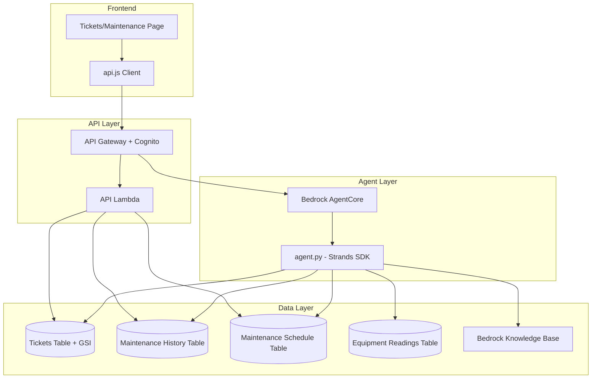

# Design Document: Appliance Maintenance Support

## Overview

This feature extends the existing restaurant monitoring agent (Nova Sonic) to handle comprehensive appliance maintenance workflows beyond temperature monitoring. The system adds maintenance ticket lifecycle management, service history tracking, preventive maintenance scheduling, troubleshooting assistance, equipment lifecycle management, multi-equipment issue correlation, and maintenance cost tracking.

The design builds on the existing Strands SDK agent architecture, extending `agent.py` with new `@tool` decorated functions, adding new DynamoDB tables where the existing schema is insufficient, and enhancing the frontend tickets page with maintenance-specific views.

### Key Design Decisions

1. **Extend existing `create_ticket` tool** rather than replacing it — the enhanced version adds maintenance-specific fields (maintenance_type, cost, technician) while remaining backward-compatible with existing ticket creation flows.
2. **New DynamoDB tables** for maintenance history and maintenance schedules — the existing tickets table lacks the schema needed for service history tracking and preventive scheduling.
3. **GSI on tickets table** for equipment-based lookups — enables duplicate detection and equipment-scoped ticket queries without full table scans.
4. **Agent-side correlation logic** for multi-equipment failure analysis — keeps the correlation lightweight and avoids introducing a separate analytics service.
5. **Knowledge Base integration** for troubleshooting — leverages the existing Bedrock Knowledge Base with equipment manuals rather than hardcoding troubleshooting steps.

## Architecture



### Data Flow

1. **User → Agent (conversational)**: User describes an issue in natural language → Agent maps to equipment/issue type → Agent executes appropriate tool → Agent responds conversationally.
2. **User → Frontend (direct)**: User views maintenance dashboard → `api.js` fetches from API Gateway → Lambda reads DynamoDB → Frontend renders.
3. **Auto-trigger**: Temperature anomaly detected → Agent creates maintenance ticket automatically via enhanced `create_ticket`.

## Components and Interfaces

### New Agent Tools

| Tool | Purpose | DynamoDB Table |
|------|---------|----------------|
| `get_maintenance_history` | Retrieve service history for equipment | maintenance-history |
| `record_maintenance` | Log a completed maintenance activity | maintenance-history |
| `get_maintenance_schedule` | Get upcoming preventive maintenance | maintenance-schedule |
| `update_maintenance_schedule` | Mark maintenance complete, set next date | maintenance-schedule |
| `get_equipment_lifecycle` | Get age, warranty, lifespan info | equipment-readings (enhanced) |
| `analyze_equipment_correlation` | Detect related multi-equipment failures | tickets + equipment-readings |
| `get_maintenance_costs` | Get cost breakdown for equipment/period | maintenance-history |
| `update_ticket` | Update ticket status, add notes, close | tickets |

### Enhanced Existing Tools

| Tool | Enhancement |
|------|-------------|
| `create_ticket` | Add `maintenance_type`, `estimated_cost`, `technician` fields; duplicate detection via GSI; auto-escalation for critical issues |
| `get_tickets` | Support filtering by `equipment_id` via new GSI |
| `search_equipment_manual` | Already supports troubleshooting queries — no changes needed |

### Tool Return Format

All tools follow the existing pattern:
```python
{"status": "success|error", "content": [{"text": "..."}]}
```

### New API Endpoints

| Endpoint | Method | Description |
|----------|--------|-------------|
| `/maintenance-history` | GET | Get maintenance history (query param: `equipment_id`, `restaurant_id`) |
| `/maintenance-schedule` | GET | Get upcoming maintenance schedule (query param: `restaurant_id`) |

### Frontend Components

- **Enhanced tickets.html**: Add maintenance-specific filters (maintenance type, equipment), maintenance history panel, upcoming schedule widget.
- **api.js extensions**: `getMaintenanceHistory(equipmentId)`, `getMaintenanceSchedule(restaurantId)` methods.

## Data Models

### Maintenance History Table

**Table**: `restaurant-kitchen-assistant-maintenance-history-prod`

| Attribute | Type | Key | Description |
|-----------|------|-----|-------------|
| `equipment_id` | String | PK (HASH) | Equipment identifier (e.g., `WC-3800-AFC001`) |
| `maintenance_date` | String | SK (RANGE) | ISO 8601 timestamp |
| `restaurant_id` | String | — | Restaurant identifier |
| `maintenance_type` | String | — | `preventive`, `corrective`, `emergency`, `inspection` |
| `description` | String | — | What was done |
| `technician` | String | — | Who performed the work |
| `resolution` | String | — | How the issue was resolved |
| `parts_cost` | Number | — | Cost of parts (USD) |
| `labor_cost` | Number | — | Cost of labor (USD) |
| `total_cost` | Number | — | Total maintenance cost (USD) |
| `ticket_id` | String | — | Associated ticket ID (if any) |
| `created_at` | String | — | Record creation timestamp |

**GSI**: `restaurant-index` — PK: `restaurant_id`, SK: `maintenance_date` (for restaurant-scoped history queries)

### Maintenance Schedule Table

**Table**: `restaurant-kitchen-assistant-maintenance-schedule-prod`

| Attribute | Type | Key | Description |
|-----------|------|-----|-------------|
| `equipment_id` | String | PK (HASH) | Equipment identifier |
| `maintenance_type` | String | SK (RANGE) | Type of scheduled maintenance |
| `restaurant_id` | String | — | Restaurant identifier |
| `next_due_date` | String | — | ISO 8601 date of next maintenance |
| `frequency_days` | Number | — | Days between maintenance cycles |
| `last_completed` | String | — | Date of last completion |
| `status` | String | — | `scheduled`, `overdue`, `completed` |
| `description` | String | — | What maintenance involves |
| `assigned_technician` | String | — | Default technician |

**GSI**: `restaurant-schedule-index` — PK: `restaurant_id`, SK: `next_due_date` (for restaurant-scoped schedule queries)
**GSI**: `due-date-index` — PK: `status`, SK: `next_due_date` (for overdue/upcoming queries across all restaurants)

### Enhanced Tickets Table (GSI Addition)

Add a GSI to the existing `restaurant-kitchen-assistant-tickets-production` table:

**GSI**: `equipment-index` — PK: `equipment_id`, SK: `created_at`

This enables:
- Duplicate ticket detection for the same equipment
- Equipment-scoped ticket history queries
- Correlation analysis across equipment

### Enhanced Ticket Schema

Extend existing ticket items with optional maintenance fields:

| New Attribute | Type | Description |
|---------------|------|-------------|
| `maintenance_type` | String | `preventive`, `corrective`, `emergency`, `inspection` |
| `estimated_cost` | Number | Estimated repair cost (USD) |
| `technician` | String | Assigned technician name |
| `resolution_notes` | String | Notes on how issue was resolved |
| `resolved_at` | String | ISO 8601 timestamp of resolution |
| `escalated` | Boolean | Whether ticket was auto-escalated |

### Equipment Readings Enhancement

Add optional lifecycle fields to existing equipment items:

| New Attribute | Type | Description |
|---------------|------|-------------|
| `installation_date` | String | ISO 8601 date of installation |
| `warranty_expiration` | String | ISO 8601 date warranty expires |
| `expected_lifespan_years` | Number | Manufacturer recommended lifespan |
| `model_number` | String | Equipment model (e.g., `WC-3800`) |


## Correctness Properties

*A property is a characteristic or behavior that should hold true across all valid executions of a system — essentially, a formal statement about what the system should do. Properties serve as the bridge between human-readable specifications and machine-verifiable correctness guarantees.*

### Property 1: Equipment retrieval returns correct restaurant-scoped results

*For any* restaurant ID and any set of equipment records across multiple restaurants, querying equipment by restaurant_id SHALL return exactly the equipment belonging to that restaurant — no more, no less.

**Validates: Requirements 1.1, 1.2**

### Property 2: Equipment lifecycle data completeness

*For any* equipment record with lifecycle fields (installation_date, warranty_expiration, expected_lifespan_years, model_number), the formatted lifecycle response SHALL include equipment type, model, installation date, warranty status, years in service, and expected remaining lifespan.

**Validates: Requirements 1.4, 6.4**

### Property 3: Ticket creation persists all required fields

*For any* valid issue description, priority, and category, creating a ticket SHALL produce a ticket record containing the provided fields plus a generated ticket_id, status of "open", and a created_at timestamp.

**Validates: Requirements 2.1**

### Property 4: Duplicate ticket detection for same equipment

*For any* equipment that already has an open ticket, attempting to create another ticket for the same equipment SHALL detect the existing open ticket and warn about the duplicate.

**Validates: Requirements 2.2**

### Property 5: Ticket update round-trip

*For any* existing ticket and any valid update (status change, note addition, or closure), applying the update and then reading the ticket back SHALL reflect exactly the changes made.

**Validates: Requirements 2.4**

### Property 6: Critical issue auto-escalation

*For any* ticket created with a critical issue (priority "critical"), the ticket SHALL have its escalated flag set to true.

**Validates: Requirements 2.5**

### Property 7: Maintenance history retrieval correctness and completeness

*For any* equipment with maintenance history records, querying history by equipment_id SHALL return all records for that equipment (and no records from other equipment), each containing date, maintenance_type, technician, description, and resolution.

**Validates: Requirements 3.1, 3.2**

### Property 8: Schedule status reflects due date correctly

*For any* maintenance schedule entry, the computed status SHALL be "overdue" if next_due_date is in the past, "due_soon" if next_due_date is within 7 days, and "scheduled" otherwise.

**Validates: Requirements 4.1, 4.4**

### Property 9: Schedule completion advances next due date

*For any* maintenance schedule with a known frequency_days, marking it as completed SHALL set next_due_date to completion_date + frequency_days and update last_completed to the completion date.

**Validates: Requirements 4.3**

### Property 10: Troubleshooting steps are sequentially formatted

*For any* list of troubleshooting steps, the formatting function SHALL produce a numbered, sequential output where each step is clearly delineated and the order is preserved.

**Validates: Requirements 5.2**

### Property 11: Warranty and lifespan threshold detection

*For any* equipment record, the system SHALL flag warranty expiration if warranty_expiration is within 30 days, and SHALL recommend replacement evaluation if years_in_service exceeds expected_lifespan_years.

**Validates: Requirements 6.1, 6.2, 6.3**

### Property 12: Multi-equipment failure correlation detection

*For any* set of tickets, correlation SHALL be detected if and only if two or more equipment failures occur at the same restaurant within a configurable time window (default 24 hours). Tickets at different restaurants or outside the time window SHALL be treated as independent.

**Validates: Requirements 7.1, 7.4**

### Property 13: Maintenance cost recording round-trip

*For any* maintenance record with parts_cost and labor_cost, recording and then retrieving the record SHALL preserve the exact cost values, and total_cost SHALL equal parts_cost + labor_cost.

**Validates: Requirements 8.1**

### Property 14: Cost aggregation correctness

*For any* set of maintenance records within a time period, the reported total cost SHALL equal the sum of individual total_cost values for records in that period.

**Validates: Requirements 8.2**

### Property 15: Cost-based replacement recommendation

*For any* equipment where cumulative maintenance costs exceed a replacement cost threshold, the system SHALL recommend considering replacement.

**Validates: Requirements 8.3**

### Property 16: Temperature anomaly auto-ticket creation

*For any* temperature reading that exceeds the equipment's critical threshold, the system SHALL create a maintenance ticket. Readings within normal range SHALL NOT trigger ticket creation.

**Validates: Requirements 9.1**

## Error Handling

### Agent Tool Errors

| Error Scenario | Handling Strategy |
|----------------|-------------------|
| DynamoDB read failure | Return `{"status": "error", "content": [{"text": "..."}]}` with user-friendly message; agent retries up to 3 times for transient errors |
| Equipment not found | Return informative message suggesting the user verify the equipment ID or list available equipment |
| Duplicate ticket detected | Return warning with existing ticket details; ask user if they want to create anyway |
| Invalid priority/category | Validate input against allowed values; return error with valid options |
| Knowledge Base unavailable | Fall back to hardcoded basic troubleshooting steps in `get_troubleshooting` |
| Cost calculation with missing data | Skip records with missing cost fields; note incomplete data in response |

### Frontend Errors

| Error Scenario | Handling Strategy |
|----------------|-------------------|
| API timeout | Show loading spinner with timeout message after 30s; offer retry |
| Authentication failure | Redirect to login page via existing Cognito flow |
| Empty data responses | Show "No data available" with contextual suggestions |
| Malformed API response | Log error, show generic error message, don't expose internals |

### Data Integrity

- All DynamoDB writes use conditional expressions where appropriate (e.g., ticket creation checks for existing open tickets)
- Cost values stored as DynamoDB Number type to avoid floating-point issues
- Timestamps always stored in ISO 8601 format
- Equipment IDs validated against known format patterns before queries

## Testing Strategy

### Unit Tests (Example-Based)

- Test `create_ticket` with specific known inputs and verify output structure
- Test error handling for missing equipment, invalid priorities
- Test edge cases: empty maintenance history, no scheduled maintenance
- Test troubleshooting safety warnings for hazardous equipment (fryer, grill)
- Test graceful degradation when integration data is unavailable

### Property-Based Tests

Property-based testing is appropriate for this feature because the agent tools are Python functions with clear input/output behavior, and many acceptance criteria express universal properties over varying inputs.

**Library**: [Hypothesis](https://hypothesis.readthedocs.io/) (Python)

**Configuration**: Minimum 100 iterations per property test.

**Tag format**: `Feature: appliance-maintenance-support, Property {number}: {property_text}`

Each correctness property (1–16) maps to a single property-based test that generates random valid inputs and verifies the property holds. Key generators needed:

- **Equipment generator**: Random equipment records with valid IDs, types, temperatures, lifecycle fields
- **Ticket generator**: Random tickets with valid priorities, categories, statuses, timestamps
- **Maintenance record generator**: Random maintenance history entries with costs, dates, types
- **Schedule generator**: Random maintenance schedules with due dates and frequencies

### Integration Tests

- Test agent end-to-end with natural language inputs (Requirements 10.1–10.4)
- Test Knowledge Base search for troubleshooting (Requirements 5.1, 5.3, 5.4)
- Test cross-system correlation between inventory and maintenance (Requirements 9.2, 9.3)
- Test DynamoDB GSI queries return correct results

### Infrastructure Tests

- Verify CloudFormation template creates tables with correct schemas, GSIs, and encryption
- Verify IAM policies grant least-privilege access to new tables
- Verify KMS encryption is enabled on new DynamoDB tables
