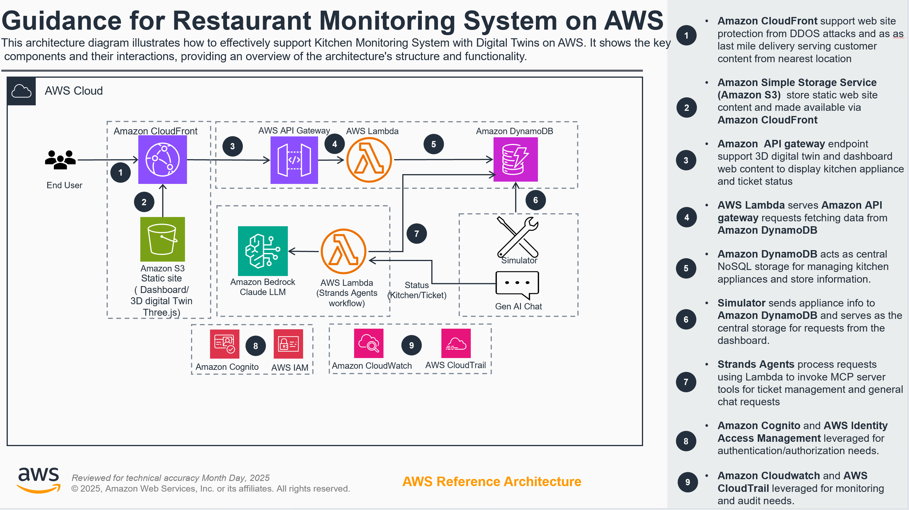

# Guidance for Restaurant Monitoring Agents on AWS

## Table of Contents

- [Overview](#overview)
- [Architecture](#architecture)
- [Prerequisites](#prerequisites)
- [Deployment Steps](#deployment-steps)
- [Usage](#usage)
- [Cleanup](#cleanup)
- [Security](#security)
- [Cost](#cost)
- [License](#license)

## Overview

This guidance demonstrates how to build an AI-powered restaurant monitoring system using AWS services. The solution uses intelligent agents to monitor restaurant equipment across 10 Georgia locations with real-time anomaly detection, automated ticket creation, and conversational AI interfaces for restaurant operations management.

### Key Features

- **Intelligent Monitoring Agents**: AI-powered agents that analyze equipment data and detect anomalies
- **Real-time Equipment Monitoring**: Track temperature data across 10 appliances per location
- **Automated Ticket Creation**: Agents automatically create maintenance tickets for equipment issues
- **Interactive Dashboard**: 3D visualization with live data and agent chat interface
- **Secure Authentication**: Cognito-based user management with self-registration

### Target Audience

This guidance is designed for:
- Solution architects looking to implement AI-powered monitoring systems
- Developers building restaurant or facility management applications
- Operations teams seeking automated monitoring and alerting solutions

## Architecture



### Core Components

- **Restaurant Monitoring Agents**: AI-powered agents using Amazon Bedrock for intelligent analysis
- **Equipment Data Simulator**: Generates realistic temperature data across 10 Georgia restaurant locations
- **DynamoDB Tables**: Stores restaurant data, equipment readings, maintenance tickets, and agent conversation history
- **API Gateway**: RESTful endpoints for dashboard data and agent interactions
- **Agent Workflow Engine**: Lambda functions orchestrating monitoring agents with conversation history
- **Monitoring Dashboard**: HTML/CSS/JS frontend with 3D visualization and agent chat interface
- **Amazon Cognito**: Secure user management with self-registration and session handling

### AWS Services Used

- Amazon DynamoDB
- Amazon API Gateway
- AWS Lambda
- Amazon S3
- Amazon CloudFront
- Amazon Cognito
- Amazon Bedrock
- AWS CloudFormation

## Prerequisites

Before deploying this solution, ensure you have:

- AWS CLI configured with appropriate permissions
- AWS account with access to the required services
- Python 3.9 or later
- Bash shell (for deployment scripts)

### Required AWS Permissions

The deployment requires permissions for:
- CloudFormation stack creation and management
- IAM role creation and management
- DynamoDB table creation and management
- API Gateway creation and configuration
- Lambda function deployment
- S3 bucket creation and management
- CloudFront distribution management
- Cognito User Pool and Identity Pool management

## Deployment Steps

### Quick Deployment

Use the automated deployment script for complete setup:

```bash
./utils/deploy.sh
```

This script will:
1. Deploy Restaurant Monitoring Agent Base Infrastructure
2. Deploy Restaurant Monitoring Agent Workflow Lambda functions
3. Automatically update Cognito configuration
4. Refresh website content

### Manual Deployment Steps

If you prefer manual deployment:

1. **Deploy base infrastructure**
   ```bash
   aws cloudformation deploy \
     --template-file infrastructure/restaurant-monitoring-base-template.yaml \
     --stack-name restaurant-monitoring-agents-base-infrastructure-production \
     --capabilities CAPABILITY_IAM CAPABILITY_NAMED_IAM
   ```

2. **Deploy agent workflows**
   ```bash
   aws cloudformation deploy \
     --template-file infrastructure/strands-agent-chat-workflow.yaml \
     --stack-name restaurant-monitoring-agents-workflow-production \
     --capabilities CAPABILITY_IAM CAPABILITY_NAMED_IAM
   ```

3. **Update website configuration**
   ```bash
   ./utils/refresh-website.sh
   ```

### Post-Deployment Steps

1. **Start equipment simulator**
   ```bash
   python utils/simple_simulator.py
   ```

2. **Test API endpoints**
   ```bash
   python utils/test_strands_api.py
   ```

3. **Access the dashboard** using the CloudFront URL from deployment output

## Usage

### Accessing the Dashboard

1. Navigate to the CloudFront URL provided in the deployment output
2. Sign up for a new account or sign in with existing credentials
3. View real-time restaurant status powered by monitoring agents
4. Interact with restaurant monitoring agents through the chat interface

### API Endpoints

The system provides the following REST API endpoints:

- `GET /restaurants` - List all restaurant locations with agent-analyzed status
- `GET /equipment` - Get equipment readings processed by monitoring agents
- `GET /tickets` - Get maintenance tickets created by restaurant monitoring agents
- `POST /strands-agent-chat` - Direct interface to restaurant monitoring agents

### Geographic Coverage

The system covers 10 Georgia restaurant locations:
- Atlanta (AFC-001), Savannah (AFC-002), Augusta (AFC-003)
- Macon (AFC-004), Athens (AFC-005), Columbus (AFC-006)
- Brunswick (AFC-007), Albany (AFC-008), Valdosta (AFC-009)
- Cumming (AFC-010)

## Cleanup

To remove all deployed resources and avoid ongoing charges:

```bash
./utils/cleanup.sh
```

**⚠️ WARNING: This will permanently delete ALL resources and data!**

The cleanup script will:
1. Empty S3 buckets
2. Delete CloudFormation stacks
3. Clean up orphaned resources
4. Provide cleanup summary

## Security

This implementation follows AWS security best practices:

### Infrastructure Security
- **Encryption**: All DynamoDB tables and S3 buckets use server-side encryption
- **Access Logging**: S3 access logs and CloudFront logs enabled
- **IAM Security**: Least privilege roles with account/region conditions
- **WAF Protection**: CloudFront protected by AWS WAF with managed rule sets

### Application Security
- **Authentication**: Cognito provides secure user management
- **Authorization**: IAM roles with scoped permissions
- **Network Security**: CloudFront with HTTPS enforcement
- **Input Validation**: Secure coding practices with proper input sanitization

## Cost

This guidance uses the following billable AWS services:

- Amazon DynamoDB (on-demand pricing)
- Amazon API Gateway (per request)
- AWS Lambda (per invocation)
- Amazon S3 (storage and requests)
- Amazon CloudFront (data transfer)
- Amazon Cognito (monthly active users)
- Amazon Bedrock (per token for AI features)

For cost estimation, use the [AWS Pricing Calculator](https://calculator.aws).

### Cost Optimization Tips

- Use DynamoDB on-demand pricing for variable workloads
- Enable CloudFront caching to reduce origin requests
- Monitor Lambda function duration and memory usage
- Use S3 lifecycle policies for log retention

## License

This library is licensed under the MIT-0 License. See the [LICENSE](LICENSE) file for details.

## Contributing

See [CONTRIBUTING](CONTRIBUTING.md) for more information.

## Additional Resources

- [AWS Solutions Library](https://aws.amazon.com/solutions/)
- [Amazon Bedrock Documentation](https://docs.aws.amazon.com/bedrock/)
- [AWS Well-Architected Framework](https://aws.amazon.com/architecture/well-architected/)

---

© 2024 Amazon Web Services, Inc. or its affiliates. All Rights Reserved.
